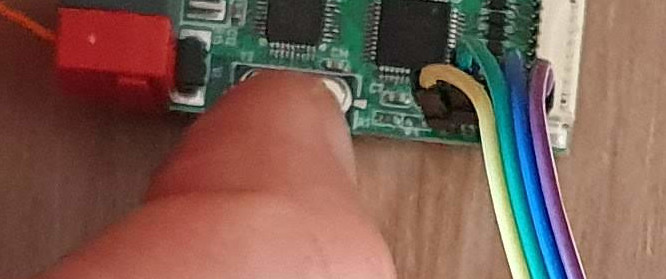

# Hacking H8I8O KNX device

Shop: https://www.aliexpress.com/item/1005003124183354.html and more.

Related discussion on knx Arduino library https://github.com/thelsing/knx/issues/181.

## Steps to connect via SWD

Warning: it's highly recommended to use isolated Segger J-Link! I use generic USB isolator from aliexpress. At least make sure the is no ground loop between your PC and the device (KNX etc.), use laptop powered from battery.

Warning: Original firmware will be erased. There is no way back.

The following [script](h8i8o-swd-loop.sh) was tested in Linux. Make sure the [STM32CubeProgrammer](https://www.st.com/en/development-tools/stm32cubeprog.htm) is installed in ~/STMicroelectronics/STM32Cube/STM32CubeProgrammer (see path in the [script](h8i8o-swd-loop.sh))

1. Download [h8i8o-swd-loop.sh](h8i8o-swd-loop.sh) script and [firmware-blink.bin](firmware-blink.bin) firmware.

2. Run the script in your terminal `./h8i8o-swd-loop.sh` (may require adding executable attribute by `chmod +x h8i8o-swd-loop.sh` before). The script loops and tries to connect to H8I8O via the ST-Link.

3. Connect ST-Link probe clone to H8I8O:  the 4 pins marked D, C, G and V are SWDIO, SWDCLK, GND and +3.3V. I use male-female dupont wires. Cheap ST-Link clones work here well, we appreciate they provide +3.3V output (not sure the original ST-Link does that). Once you connect the board, the running script will succeed and will erase and flash the testing "blink" firmware. You may try disconnecting +3.3V and connecting again while script is running in case the script won't "catch".

4. Now the H8I8O KNX device is running blink firmware, ie. blinking the built-in LED. The SWD is enabled and so the device is ready to be flashed and debugged by any supported tool.

## Related files

Files you receive from a seller:
* https://en.webshare.cz/#/file/oJc05nklKG/knx-h8i8o-v0-3-pdf
* https://en.webshare.cz/#/file/2DQ9qPhR8v/test-project-h8i8o-v3-knxproj

(choose Download slowly on the hosting site)
